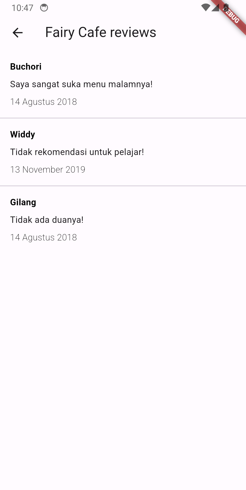

    <h1>D'resto</h1>
    
An Flutter app for restaurant finder

---

  
  
  

## Features
- List All Restaurant
- Detail Restaurant

## Tech Stack & Library
- [injectable](https://pub.dev/packages/injectable) for Dependency Injection.
- [Bloc](https://pub.dev/packages/bloc) for BLoC Design Pattern (Business Logic Component).
- [Retrofit](https://pub.dev/packages/retrofit) for HTTP Client.
- [dart_mappable](https://pub.dev/packages/dart_mappable) for creating models.
- [logger](https://pub.dev/packages/logger) for A logger.
- Used AndroidX, Jetpack Compose, Material Design Components 3, and any more libraries.

## Data Source
D'resto using the [Restaurant API](https://restaurant-api.dicoding.dev/) for constructing RESTful API. 
Restaurant API provides a RESTful API interface to highly detailed objects built from thousands of lines of data related to restaurants.